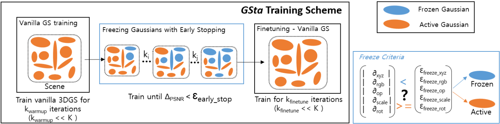

# GSta: Efficient Training Scheme with Siestaed Gaussians for Monocular 3D Scene Reconstruction

 <a href="https://scholar.google.com/citations?hl=en&user=weuz_ewAAAAJ">Anil Armagan1</a>, <a href="https://scholar.google.com/citations?hl=en&user=1hGFehQAAAAJ">Albert Sa&aacute; Garriga1</a>, <a href="https://uk.linkedin.com/in/bruno-manganelli-97a78b172">Bruno Manganelli1</a>, <a href="https://kr.linkedin.com/in/q1kim">Kyuwon Kim2</a>, <a href="https://scholar.google.com/citations?hl=en&user=-sjpsWwAAAAJ">M. Kerim Yucel1</a> 

 1Samsung R&D Institute UK (SRUK), 2Samsung Electronics

[Project Page](https://anilarmagan.github.io/SRUK-GSta/)

Code coming soon!

  

    <h2>BibTeX</h2>
    <pre>
      <code>
        @Article{armagan2025gsta,
      author       = {Armagan},
      title        = {GSta: Efficient Training Scheme with Siestaed Gaussians for Monocular 3D Scene Reconstruction},
      journal      = {in submission},
      year         = {2025},
      url          = {https://github.com/anilarmagan/SRUK-GSta)}
}
</code>
</pre>
  

